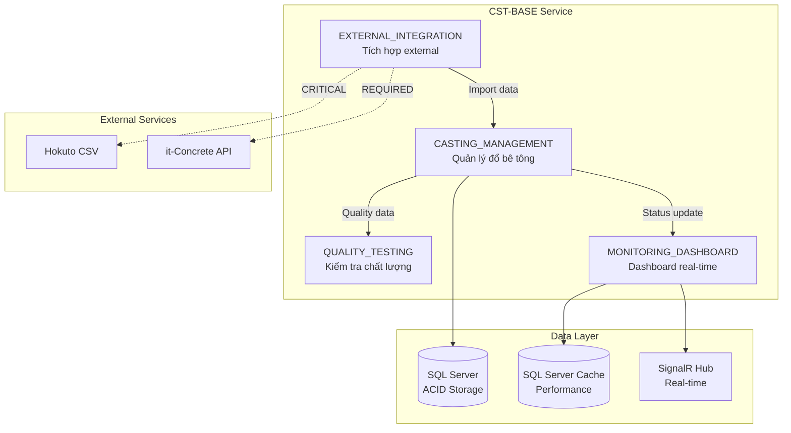

# Section 02: Component - Template v1.0
## Construction Management System (施工管理統合システム)

## Objective

Generate Component sections (2.1 and 2.2) for Basic Design document.

This section shows component relationships and service boundaries.

---

## Technology Context

| Aspect | Value |
|--------|-------|
| **Project** | Construction Management System |
| **Backend** | C# 12 + ASP.NET Core 8 |
| **Database** | SQL Server 2022 |
| **Diagram** | Mermaid flowchart |

---

## Constraints

### MUST Include

1. **Section 2.1**: Component Diagram (Mermaid flowchart)
2. **Section 2.2**: Service Boundaries (CRITICAL/REQUIRED/OPTIONAL)
3. **Components**: EXACT names and count from Section 1.1
4. **FR References**: From reasoning.json
5. **Dependency Classification**: CRITICAL/REQUIRED/OPTIONAL

### MUST Exclude

- ❌ Change component names from Section 1.1
- ❌ Add new components not in Section 1.1
- ❌ SQL/code in diagrams
- ❌ English-only content (Vietnamese ≥60%)

---

## Template Logic (Pseudo-Code)

```pseudo
# ============================================================
# TEMPLATE: 02-component.md
# PURPOSE: Generate Sections 2.1 and 2.2 for Basic Design
# ============================================================

# ────────────────────────────────────────────────────────────
# STEP 1: LOAD CONTEXT
# ────────────────────────────────────────────────────────────

FUNCTION load_context(feature_code, sub_code):
    context = {}

    # Load reasoning.json
    reasoning_file = f".claude/memory-bank/master/{feature_code}-{sub_code}/reasoning.json"
    context.reasoning = json.load(reasoning_file)

    # Load Section 1.1 for consistency check
    section1_file = f"documents/features/{feature_code}-{sub_code}/{feature_code}-{sub_code}-basic-design.md"
    context.section1 = extract_section(section1_file, "1.1")

    # Extract components from reasoning.json
    context.components = context.reasoning.components
    context.technologies = context.reasoning.technologies

    RETURN context

# ────────────────────────────────────────────────────────────
# STEP 2: GENERATE COMPONENT DIAGRAM (2.1)
# ────────────────────────────────────────────────────────────

FUNCTION generate_component_diagram(context):
    output = []

    output.append("### 2.1 Component Diagram\n\n")
    output.append("```mermaid\n")
    output.append("graph TB\n")

    # Service subgraph
    service_name = f"{context.feature_code}-{context.sub_code} Service"
    output.append(f'    subgraph "{service_name}"\n')

    # Component nodes
    FOR component IN context.components:
        short_name = generate_short_name(component.name)
        output.append(f'        {short_name}[{component.name}<br/>{component.responsibility[:30]}...]\n')

    # Component relationships
    FOR i, comp1 IN enumerate(context.components):
        FOR j, comp2 IN enumerate(context.components):
            IF i < j AND has_relationship(comp1, comp2):
                output.append(f'        {short_name(comp1)} -->|{relationship_label}| {short_name(comp2)}\n')

    output.append("    end\n\n")

    # Data layer subgraph
    output.append('    subgraph "Data Layer"\n')
    FOR tech IN context.technologies:
        IF is_data_tech(tech):
            output.append(f'        {tech_node_name(tech)}[({tech.name}<br/>{tech.purpose[:20]}...)]\n')
    output.append("    end\n\n")

    # External services subgraph
    output.append('    subgraph "External Services"\n')
    output.append('        HOKUTO[Hokuto CSV]\n')
    output.append('        ITCON[it-Concrete API]\n')
    output.append("    end\n\n")

    # Component to technology connections
    FOR component IN context.components:
        FOR tech IN get_tech_dependencies(component):
            output.append(f'    {short_name(component)} --> {tech_node_name(tech)}\n')

    # External service connections
    output.append('    INTEGRATION -.->|CRITICAL| HOKUTO\n')
    output.append('    INTEGRATION -.->|REQUIRED| ITCON\n')

    output.append("```\n\n")

    # Interaction descriptions (Vietnamese)
    output.append("**Mô tả luồng tương tác (Interaction Flow):**\n\n")
    interaction_num = 1
    FOR comp1, comp2, description IN get_interactions(context):
        output.append(f"{interaction_num}. **{comp1}** → **{comp2}**: {description}\n")
        interaction_num += 1

    RETURN "".join(output)

# ────────────────────────────────────────────────────────────
# STEP 3: GENERATE SERVICE BOUNDARIES (2.2)
# ────────────────────────────────────────────────────────────

FUNCTION generate_service_boundaries(context):
    output = []

    output.append("### 2.2 Service Boundaries\n\n")

    # Internal Components table
    output.append("**Internal Components** (trong service này):\n\n")
    output.append("| Component | Trách nhiệm | FRs tương ứng | Dependencies |\n")
    output.append("|-----------|------------|---------------|---------------|\n")

    FOR component IN context.components:
        frs = ", ".join(component.frs)
        deps = get_dependencies_string(component, context)
        output.append(f"| {component.name} | {component.responsibility} | {frs} | {deps} |\n")

    output.append("\n")

    # External Dependencies table
    output.append("**External Dependencies:**\n\n")
    output.append("| Service | Purpose | Dependency Level | Rationale |\n")
    output.append("|---------|---------|------------------|------------|\n")

    external_deps = [
        {
            "name": "Hokuto CSV",
            "purpose": "Dữ liệu từ xe trộn bê tông",
            "level": "CRITICAL",
            "rationale": "Nguồn dữ liệu chính cho casting monitoring - nếu down thì không có data"
        },
        {
            "name": "it-Concrete API",
            "purpose": "Dữ liệu dự án và specifications",
            "level": "REQUIRED",
            "rationale": "Cần có để validate casting specs - có thể degraded mode nếu unavailable"
        },
        {
            "name": "Weather API",
            "purpose": "Dữ liệu thời tiết cho environmental factors",
            "level": "OPTIONAL",
            "rationale": "Nice to have - không ảnh hưởng core functionality"
        }
    ]

    FOR dep IN external_deps:
        output.append(f"| {dep.name} | {dep.purpose} | {dep.level} | {dep.rationale} |\n")

    output.append("\n")

    # Dependency definitions
    output.append("**Dependency Definitions:**\n\n")
    output.append("- **CRITICAL**: Service down → Feature completely broken\n")
    output.append("- **REQUIRED**: Service down → Degraded mode possible\n")
    output.append("- **OPTIONAL**: Service down → No impact on core functionality\n")

    RETURN "".join(output)

# ────────────────────────────────────────────────────────────
# STEP 4: FORMAT OUTPUT
# ────────────────────────────────────────────────────────────

FUNCTION format_section(context):
    output = []

    # Section 2.1
    output.append(generate_component_diagram(context))

    output.append("\n---\n\n")

    # Section 2.2
    output.append(generate_service_boundaries(context))

    RETURN "".join(output)

# ────────────────────────────────────────────────────────────
# STEP 5: VALIDATE OUTPUT (Q1-Q4)
# ────────────────────────────────────────────────────────────

FUNCTION validate_output(result, context):
    issues = []

    # Q1: Component count matches Section 1.1?
    component_count = count_components_in_result(result)
    expected_count = len(context.components)
    IF component_count != expected_count:
        issues.append(f"Component count mismatch: {component_count} vs {expected_count}")

    # Q1: Component names EXACT match Section 1.1?
    FOR component IN context.components:
        IF NOT contains(result, component.name):
            issues.append(f"Missing component: {component.name}")

    # Q2: All components in table have FR references?
    FOR component IN context.components:
        IF NOT has_fr_reference(result, component):
            issues.append(f"{component.name} missing FR references in table")

    # Q2: External dependencies classified correctly?
    IF NOT contains(result, "CRITICAL") OR NOT contains(result, "REQUIRED"):
        issues.append("Missing dependency level classifications")

    # Q3: Vietnamese ratio ≥60%?
    vietnamese_ratio = calculate_vietnamese_ratio(result)
    IF vietnamese_ratio < 0.60:
        issues.append(f"Vietnamese ratio too low: {vietnamese_ratio:.1%}")

    # Q4: No prohibited content?
    prohibited = [
        "SELECT ", "INSERT ", "UPDATE ",
        "class ", "public ", "private ",
        "CREATE TABLE", "connection string"
    ]
    FOR pattern IN prohibited:
        IF contains(result, pattern):
            issues.append(f"Contains prohibited content: {pattern}")

    IF issues.length > 0:
        RETURN {"valid": False, "issues": issues}
    ELSE:
        RETURN {"valid": True, "issues": []}
```

---

## Output Format Example

```markdown
### 2.1 Component Diagram



**Mô tả luồng tương tác (Interaction Flow):**

1. **EXTERNAL_INTEGRATION** → **CASTING_MANAGEMENT**: Import dữ liệu từ Hokuto CSV và it-Concrete
2. **CASTING_MANAGEMENT** → **QUALITY_TESTING**: Gửi casting record để thực hiện quality test
3. **CASTING_MANAGEMENT** → **MONITORING_DASHBOARD**: Cập nhật trạng thái casting cho real-time display
4. **CASTING_MANAGEMENT** → **SQL Server**: Lưu trữ casting data với ACID compliance
5. **MONITORING_DASHBOARD** → **SignalR Hub**: Push updates tới 50+ concurrent clients
6. **MONITORING_DASHBOARD** → **SQL Server Cache**: Cache balance/summary data để đạt <1s response

---

### 2.2 Service Boundaries

**Internal Components** (trong service này):

| Component | Trách nhiệm | FRs tương ứng | Dependencies |
|-----------|------------|---------------|---------------|
| CASTING_MANAGEMENT | Quản lý thông tin đổ bê tông và xe trộn | FR-CST-BASE-001, FR-CST-BASE-002, FR-CST-BASE-003 | QUALITY_TESTING (REQUIRED), SQL Server (CRITICAL) |
| QUALITY_TESTING | Quản lý kiểm tra chất lượng bê tông | FR-QLT-BASE-001, FR-QLT-BASE-002 | SQL Server (CRITICAL) |
| MONITORING_DASHBOARD | Hiển thị real-time dashboard và alerts | FR-MON-BASE-001, FR-MON-BASE-002 | CASTING_MANAGEMENT (REQUIRED), SignalR (CRITICAL) |
| EXTERNAL_INTEGRATION | Tích hợp với Hokuto CSV và it-Concrete API | FR-INT-BASE-001, FR-INT-BASE-002 | Hokuto CSV (CRITICAL), it-Concrete API (REQUIRED) |

**External Dependencies:**

| Service | Purpose | Dependency Level | Rationale |
|---------|---------|------------------|-----------|
| Hokuto CSV | Dữ liệu từ xe trộn bê tông (1-second polling) | CRITICAL | Nguồn dữ liệu chính - nếu down thì không có data mới |
| it-Concrete API | Dữ liệu dự án và specifications | REQUIRED | Cần để validate specs - có thể degraded mode |
| Weather API | Dữ liệu thời tiết cho environmental factors | OPTIONAL | Nice to have - không ảnh hưởng core |

**Dependency Definitions:**

- **CRITICAL**: Service down → Feature completely broken
- **REQUIRED**: Service down → Degraded mode possible
- **OPTIONAL**: Service down → No impact on core functionality
```

---

*Section 02: Component - Template v1.0*
*Construction Management System (施工管理統合システム)*
*EPS Framework v3.0*
