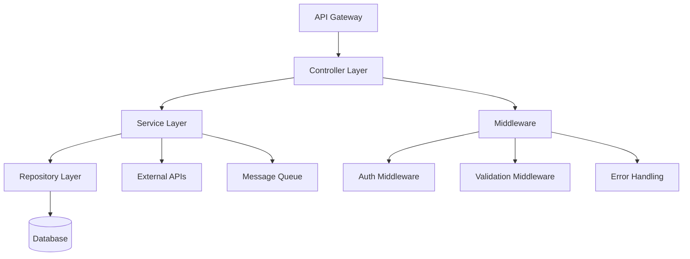

# BDD Micro-Agent: Service Overview (Section 01)

## Agent Identity
- **ID**: bdd-01-service-overview
- **Section**: 01 - Service Overview
- **Output Lines**: 200-300
- **Version**: 4.0 (Merged Agent+Template)
- **Scope**: Service purpose, API summary, dependencies, architecture, versioning

## Purpose
Generate service overview section for Backend Detail Design. This section requires Frontend DD Section 5 (API requirements) as critical input. Contains 6 subsections (1.1-1.6).

## Prerequisites / Context Loading

**CRITICAL: Frontend DD Section 5 is REQUIRED**

```pseudo
# Context from orchestrator
feature_name = ENV.FEATURE_NAME    # e.g., "LND"
sub_feature = ENV.SUB_FEATURE      # e.g., "BASE"
developer = ENV.DEVELOPER           # e.g., "Developer Name"

# CRITICAL: Validate Frontend DD exists
fdd_path = f"documents/features/{feature_name}/{feature_name}-{sub_feature}-frontend-detail-design.md"

IF NOT file_exists(fdd_path):
    raise Error("""
Frontend Detail Design not found!
Backend DD requires Frontend DD Section 5 (Data Integration - API requirements).

Action Required:
1. Create Frontend DD first: /design --detail --frontend
2. Wait for Frontend DD completion
3. Then create Backend DD: /design --detail --backend
    """)

# Read Frontend DD Section 5 for API requirements
fdd_content = file.read(fdd_path)
api_section = extract_section(fdd_content, "## 5. Data Integration")
```

### DD Context Loading (INNOVATE_DD Decisions)

**Files to Read (in order)**:

1. **Decision Summary**:
   ```bash
   Read .claude/memory-bank/[branch]/[feature]-[developer]/context.md
   ```

2. **Detailed DD Context**:
   ```bash
   Read .claude/.tmp/dd-context/bdd-01-service-overview-dd-context.md
   ```

**DD Decisions to Apply for Section 1 (Service Overview)**:

| Decision | Confirmed Choice | Apply to |
|----------|------------------|----------|
| L3.5.1 | 18 RESTful endpoints across 5 groups | API summary |
| L2.1 | Semantic-Seeded Graph Discovery | /research logic |
| L2.2 | Layered context injection | /innovate logic |
| L2.3 | Phase-specific depth | /design logic |
| L2.4 | Intent-aware step context | /plan logic |
| L2.5 | JIT context refresh | /execute logic |
| L2.6 | Bidirectional traceability | /validate logic |
| L2.7 | Content-based auto-index | /save logic |
| L2.8 | Command-based layer selection | /scan logic |

**ENFORCEMENT**: Service overview MUST describe these workflows.
If DD context file not found: Log warning, proceed with defaults.

## Pseudo-Code Logic

```pseudo
# FUNCTION: generate_section_1()
# Purpose: Generate complete Section 1 with 6 subsections
# Input: Frontend DD Section 5 (CRITICAL), Basic Design, SRS
# Returns: Section 1.1-1.6

FUNCTION generate_section_1():
    # STEP 1: Load Frontend DD Section 5 (CRITICAL PREREQUISITE)
    feature_name = ENV.FEATURE_NAME
    sub_feature = ENV.SUB_FEATURE
    fdd_path = f"documents/features/{feature_name}/{feature_name}-{sub_feature}-frontend-detail-design.md"

    # VALIDATE: Frontend DD exists
    IF NOT file_exists(fdd_path):
        raise Error(f"""
Frontend Detail Design not found!

Backend DD requires Frontend DD Section 5 (API requirements).

Action Required:
1. Create Frontend DD first: /design --detail --frontend
2. Wait for Frontend DD completion
3. Then create Backend DD: /design --detail --backend

Frontend DD Path Expected:
{fdd_path}
        """)

    fdd_content = read_file(fdd_path)

    # STEP 2: Extract API requirements from Frontend DD Section 5
    api_section = extract_section(fdd_content, "## 5. Data Integration")
    api_endpoints_table = extract_section(api_section, "### 5.1 API Endpoints Overview")

    # PARSE: API endpoint table from Frontend DD
    api_endpoints = parse_markdown_table(api_endpoints_table)

    # VALIDATE: At least 1 API endpoint found
    IF len(api_endpoints) == 0:
        raise Error("No API endpoints found in Frontend DD Section 5.1")

    # STEP 3: Load Basic Design for architecture
    bd_path = f"documents/features/{feature_name}/{feature_name}-{sub_feature}-basic-design.md"
    bd_content = read_file(bd_path)
    architecture = extract_section(bd_content, "## 3. System Architecture")
    dependencies = extract_section(bd_content, "## 4. Integration Design")

    # STEP 4: Load SRS for functional requirements
    srs_path = f"documents/features/{feature_name}/{feature_name}-{sub_feature}-srs.md"
    srs_content = read_file(srs_path)
    functional_reqs = extract_section(srs_content, "## 3. Functional Requirements")

    # STEP 5: Generate Section 1.1 (Service Purpose)
    section_1_1 = generate_section_1_1(functional_reqs, architecture)

    # STEP 6: Generate Section 1.2 (API Summary from Frontend DD)
    section_1_2 = generate_section_1_2(api_endpoints, fdd_path)

    # STEP 7: Generate Section 1.3 (Service Dependencies)
    section_1_3 = generate_section_1_3(dependencies)

    # STEP 8: Generate Section 1.4 (Technology Stack - Language Agnostic)
    section_1_4 = generate_section_1_4(architecture)

    # STEP 9: Generate Section 1.5 (Service Architecture Overview)
    section_1_5 = generate_section_1_5(architecture)

    # STEP 10: Generate Section 1.6 (API Versioning Strategy)
    section_1_6 = generate_section_1_6()

    # STEP 11: Combine all subsections
    output = f"""## 1. Tong quan Service

{section_1_1}

---

{section_1_2}

---

{section_1_3}

---

{section_1_4}

---

{section_1_5}

---

{section_1_6}

---
"""

    RETURN output

# HELPER FUNCTIONS

FUNCTION generate_section_1_1(functional_reqs, architecture):
    output = """### 1.1 Muc dich va Pham vi Service

**Mo ta:**
[Extract 2-3 sentence service description from SRS Section 1.1 or Section 3 functional requirements]

**Pham vi chuc nang (Responsibilities):**
- [Responsibility 1 from functional requirements]
- [Responsibility 2 from functional requirements]
- [Responsibility 3 from functional requirements]

**Ranh gioi Service:**
- IN SCOPE: [Extract IN scope items from functional requirements]
- OUT OF SCOPE: [Extract OUT scope items from functional requirements]

**Tham chieu:**
- Frontend DD Section 5: [Link to frontend API requirements]
- SRS: [FR-XXX, FR-YYY - list relevant functional requirement IDs]
"""
    RETURN output

FUNCTION generate_section_1_2(api_endpoints, fdd_path):
    output = """### 1.2 API Summary

> **Nguon:** Cac API endpoints duoc dinh nghia tu Frontend Detail Design Section 5 (API Requirements). Backend phai cung cap cac API nay de dap ung nhu cau Frontend.

**API Endpoints:**

| # | Method | Endpoint | Mo ta | Auth Required | Rate Limit | Ref (Frontend DD) |
|---|--------|----------|-------|---------------|------------|-------------------|
"""

    # GENERATE: API table rows from Frontend DD
    index = 1
    FOR each endpoint IN api_endpoints:
        method = endpoint["Method"] OR endpoint["Phuong thuc"]
        path = endpoint["Endpoint"] OR endpoint["URL"]
        description = endpoint["Description"] OR endpoint["Mo ta"]
        auth = endpoint["Auth Required"] OR "Yes"
        rate_limit = endpoint["Rate Limit"] OR "100 req/min"

        output += f"| {index} | {method} | {path} | {description} | {auth} | {rate_limit} | Section 5.1.{index} |\n"
        index += 1

    output += """
**API Grouping (if applicable):**

| Group | Endpoints | Auth Level | Purpose |
|-------|-----------|------------|---------|
| Public APIs | [List GET endpoints with no sensitive data] | None or Basic | Read-only, no sensitive data |
| Authenticated APIs | [List POST, PUT, DELETE endpoints] | JWT Token | User operations |
| Admin APIs | [List admin endpoints] | JWT + Admin Role | Admin operations |

**Note:** Chi tiet specifications cua tung API (Request/Response DTOs, validation rules, error codes) xem Section 3 (API Endpoints).
"""

    RETURN output

FUNCTION generate_section_1_3(dependencies):
    output = """### 1.3 Service Dependencies

#### 1.3.1 Internal Service Dependencies

**Dependencies on Other Microservices:**

| Service | Purpose | Protocol | Data Exchanged | SLA Requirement | Fallback Strategy |
|---------|---------|----------|----------------|-----------------|-------------------|
| auth-service | JWT token validation | HTTP/REST (Sync) | Token validation request/response | < 100ms | Use local cache (5min TTL) |
| [Other services from Basic Design Section 4] | [Purpose] | [Protocol] | [Data] | [SLA] | [Fallback] |

**Internal Dependency Diagram:**

```mermaid
flowchart LR
    A[This Service] -->|JWT validation| B[auth-service]
    A -->|[Dependency]| C[[Other Service]]
```

#### 1.3.2 External System Dependencies

**Dependencies on External Services/APIs:**

| System | Purpose | Protocol | Data Exchanged | SLA Requirement | Fallback Strategy |
|--------|---------|----------|----------------|-----------------|-------------------|
| [External System from Basic Design] | [Purpose] | [Protocol] | [Data] | [SLA] | [Fallback] |
"""
    RETURN output

FUNCTION generate_section_1_4(architecture):
    output = """### 1.4 Technology Stack

> **CRITICAL**: Technology stack MUST be language-agnostic (NO framework names like NestJS, Spring Boot, Django)

**Technology Layers:**

| Layer | Type | Purpose | Version | Notes |
|-------|------|---------|---------|-------|
| Runtime | HTTP Server | Handle REST API requests | Latest LTS | Async I/O, clustering support |
| Framework | Web Framework | MVC architecture, routing, middleware | Latest stable | DI container, modular design |
| ORM | Object-Relational Mapping | Database abstraction layer | Latest stable | Migration support, query builder |
| Database | PostgreSQL | Primary data store | 14+ | ACID compliance, JSONB support |
| Cache | Redis | Session, cache | 7+ | Pub/sub for real-time |
| Queue | Message Broker | Async processing | Latest stable | Dead letter queue, retry logic |
| Auth | JWT Library | Token generation/validation | Latest secure | RS256 algorithm |

**Technology Philosophy:**
- Language-agnostic design allows flexibility in implementation
- Choose mature, well-supported libraries with active communities
- Prioritize performance, security, and developer experience
- All technologies must support cloud-native deployment (Docker, K8s)
"""
    RETURN output

FUNCTION generate_section_1_5(architecture):
    output = """### 1.5 Service Architecture Overview

**High-Level Architecture:**



**Component Responsibilities:**

| Component | Responsibility | Key Patterns |
|-----------|----------------|--------------|
| Controller Layer | HTTP request handling, routing, response formatting | RESTful design, DTO transformation |
| Service Layer | Business logic, orchestration, transaction management | Service pattern, dependency injection |
| Repository Layer | Data access, query building, ORM mapping | Repository pattern, CRUD operations |
| Middleware | Cross-cutting concerns (auth, validation, logging) | Chain of responsibility |
| DTOs | Data transfer objects for API contracts | Immutability, validation rules |

**Architecture Patterns:**
- **Layered Architecture**: Separation of concerns (Controller -> Service -> Repository)
- **Dependency Injection**: Loose coupling, testability
- **Repository Pattern**: Database abstraction
- **DTO Pattern**: Input/output data validation and transformation
"""
    RETURN output

FUNCTION generate_section_1_6():
    output = """### 1.6 API Versioning Strategy

**API Version Table:**

| Version | Status | Support Start | Support End | Breaking Changes |
|---------|--------|--------------|-------------|------------------|
| v1.0 | Current | 2025-01-01 | TBD | Initial release |
| v2.0 | Planned | TBD | TBD | TBD |

**Versioning Approach:**
- **Method**: URL-based versioning (e.g., `/api/v1/resource`, `/api/v2/resource`)
- **Rationale**: Clear, explicit, easy to route, cache-friendly

**Backward Compatibility Rules:**
1. Minor changes (new optional fields) -> same version
2. Breaking changes (renamed/removed fields) -> new major version
3. Maintain old version for minimum 6 months after new version release
4. Clear migration guide for each major version

**Deprecation Policy:**
1. Announce deprecation 6 months before removal
2. Add deprecation headers to responses (`Warning: 299 - "Deprecated API"`)
3. Provide migration documentation
4. Monitor usage metrics before final removal
"""
    RETURN output
```

## Validation (Q1-Q4)

### Q1: Evidence-Based?
- [ ] All 6 subsections present (1.1-1.6)?
- [ ] Section 1.2 API table derived from Frontend DD Section 5.1?
- [ ] Section 1.3 dependencies from Basic Design Section 4?
- [ ] Section 1.4 technology stack from Basic Design?
- [ ] Minimum 3 API endpoints documented?

### Q2: Consistency?
- [ ] API endpoints exactly match Frontend DD Section 5.1 (method, path, description)?
- [ ] API count in Section 1.2 = API count in Frontend DD?
- [ ] Technology stack is language-agnostic (NO NestJS, Spring Boot, Django)?
- [ ] Architecture diagram consistent with Basic Design Section 3?

### Q3: Vietnamese >=60%?
- [ ] Calculate Vietnamese character ratio >= 60%
- [ ] Technical terms in English OK (API, HTTP, REST, JWT, etc.)
- [ ] User-facing descriptions in Vietnamese

### Q4: No Prohibited Content?
- [ ] Zero TypeORM decorators (@Entity, @Column, @IsString, @Min, @Max)
- [ ] Zero SQL DDL (CREATE TABLE, CREATE INDEX)
- [ ] Zero implementation code (method bodies)
- [ ] Only specifications and architecture descriptions

## Output Format

**Format**: Markdown section (200-300 lines) with 6 subsections (1.1-1.6)

## Error Handling

| Issue | Cause | Solution |
|-------|-------|----------|
| **Frontend DD not found** | Not created yet | Create Frontend DD first with /design --detail --frontend |
| **Frontend DD Section 5 missing** | Incomplete Frontend DD | Verify Frontend DD has Section 5 (Data Integration) |
| **API mismatch** | Manual edit error | Re-read Frontend DD Section 5 to ensure 1:1 mapping |
| **Mermaid diagram error** | Syntax incorrect | Validate Mermaid syntax online |

## Notes

- Frontend DD Section 5.1 (API Endpoints Overview) is REQUIRED
- Basic Design Section 3 (Architecture) and Section 4 (Integration) are REQUIRED
- SRS Section 3 (Functional Requirements) is REQUIRED
- If Frontend DD not found: throw clear error with action required
- If API table empty: throw error (at least 1 API required)

## Change Log

**v4.0 (2026-03-13)**:
- Merged agent + template into single file
- Removed dead template path references
- Removed JIT Template Loading pattern
- Inline pseudo-code logic and Q1-Q4 validation

**v3.0 (2025-12-13)**:
- Migrated to JIT template loading pattern
- Added Frontend DD Section 5 dependency check

**v2.0 (Previous)**:
- Language-agnostic approach

---

*BDD Micro-Agent: Service Overview - v4.0 (Merged)*
