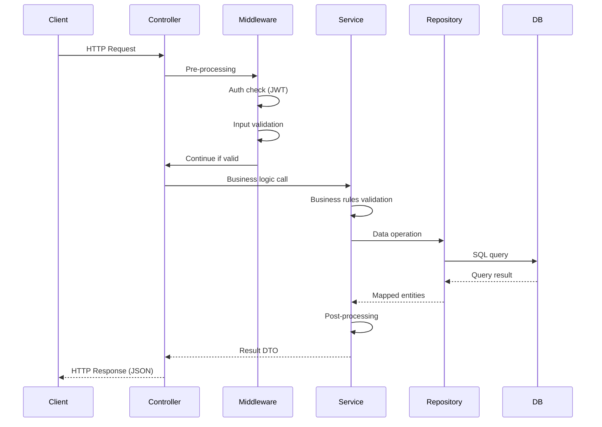
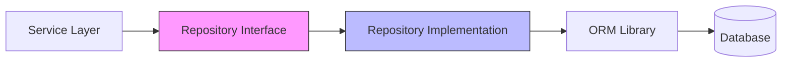
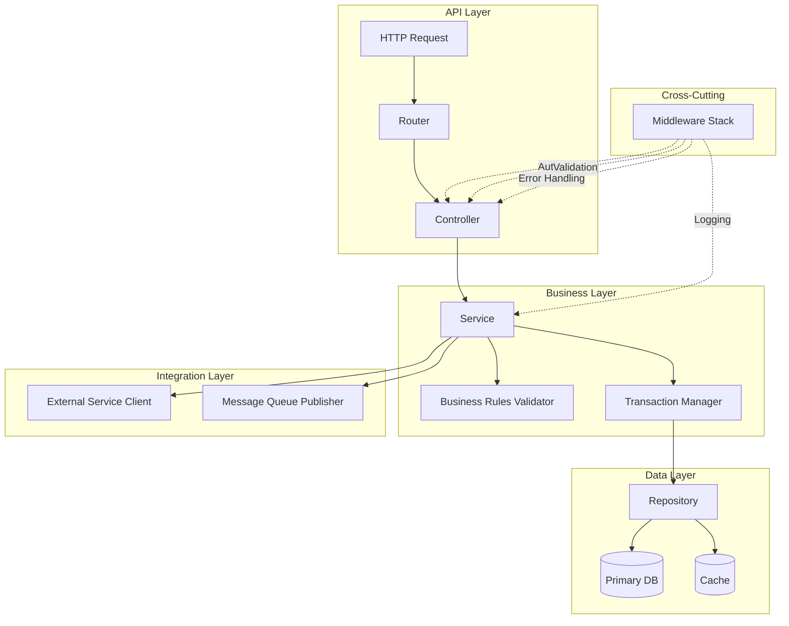
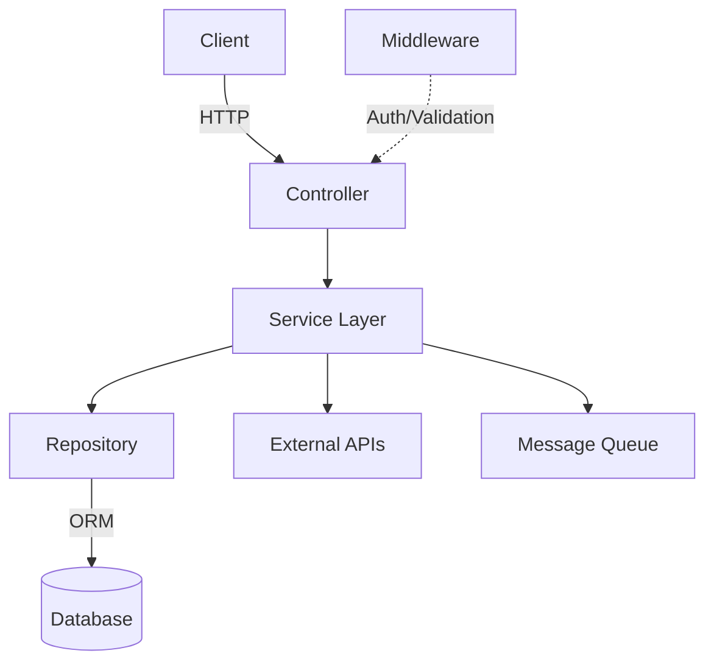
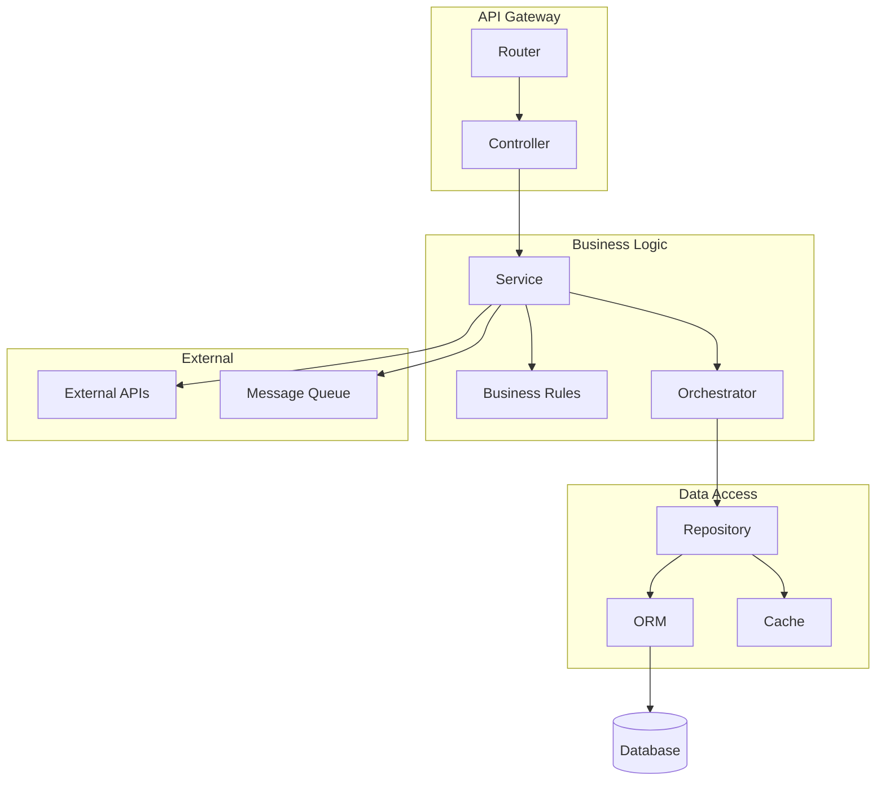

# BDD Micro-Agent: Business Logic (Section 02)

## Agent Identity
- **ID**: bdd-02-business-logic
- **Section**: 02 - Business Logic & Service Layer
- **Output Lines**: 600-800
- **Version**: 4.0 (Merged Agent+Template)
- **Scope**: Service layer architecture, business rules, workflows, state machines

## Purpose
Generate business logic specifications for Backend Detail Design. This agent contains the complete pseudo-code logic for generating service layer architecture diagrams and business logic specifications.

## Prerequisites / Context Loading

### Load Context
```pseudo
# Context from orchestrator
feature_name = ENV.FEATURE_NAME
sub_feature = ENV.SUB_FEATURE
developer = ENV.DEVELOPER

# Read SRS for business rules (BR-XXX)
srs_path = f"documents/features/{feature_name}/{feature_name}-{sub_feature}-srs.md"
srs_content = file.read(srs_path)
business_rules = extract_section(srs_content, "## 4. Business Rules")
```

### Load DD Context (INNOVATE_DD Decisions)

**CRITICAL: CLI Agent MUST read these files before generating content**

**Files to Read (in order)**:

1. **Decision Summary** (15KB - tóm tắt tất cả 108 decisions):
   ```bash
   Read .claude/memory-bank/[branch]/[feature]-[developer]/context.md
   ```

2. **Detailed DD Context** (31KB - chi tiết L1 algorithms):
   ```bash
   Read .claude/.tmp/dd-context/bdd-02-business-logic-dd-context.md
   ```

**DD Decisions to Apply for Section 2 (Core Algorithms)**:

| Decision | Confirmed Choice | Apply to |
|----------|------------------|----------|
| L1.1.1 | Configurable BFS/DFS (BFS default) | Traversal strategy |
| L1.1.3 | Weight decay 0.8/hop | Edge weight handling |
| L1.2.1 | Multi-criteria boundary | Subgraph extraction |
| L1.3.1 | Cascading match (exact→semantic) | Entity linking |
| L1.4.1 | Vector-Seeded Graph Expansion | Hybrid query |
| L1.4.2 | 60/40 weighted fusion | Result merging |
| L1.5.4 | MMR ranking (λ=0.7) | Pattern ranking |
| L1.6.1 | 4 conflict types | Conflict detection |

**ENFORCEMENT**: Business logic MUST implement these algorithms exactly.
If DD context file not found → Log warning, proceed with defaults.

## Pseudo-Code Logic

```pseudo
# FUNCTION: generate_section_2()
# Purpose: Generate complete Section 2 with 4 subsections
# Input: Basic Design (architecture), Section 01 (API list)
# Returns: Section 2.1-2.4

FUNCTION generate_section_2():
    # STEP 1: Load context
    feature_name = ENV.FEATURE_NAME
    sub_feature = ENV.SUB_FEATURE

    # STEP 2: Load Basic Design for architecture
    bd_path = f"documents/features/{feature_name}/{feature_name}-{sub_feature}-basic-design.md"
    bd_content = read_file(bd_path)
    architecture = extract_section(bd_content, "## 3. System Architecture")

    # STEP 3: Load Section 01 output (API list)
    section_01_api_list = ENV.SECTION_01_OUTPUT.extract_apis()

    # STEP 4: Generate Section 2.1 (Architecture Diagram)
    component_count = count_components(architecture)
    section_2_1 = generate_section_2_1(architecture, component_count)

    # STEP 5: Generate Section 2.2 (Logic Flow Diagram)
    section_2_2 = generate_section_2_2(section_01_api_list)

    # STEP 6: Generate Section 2.3 (Database Access Pattern)
    section_2_3 = generate_section_2_3()

    # STEP 7: Generate Section 2.4 (Component Interactions)
    section_2_4 = generate_section_2_4(architecture)

    # STEP 8: Combine all subsections
    output = f"""## 2. Business Logic Specification

{section_2_1}

---

{section_2_2}

---

{section_2_3}

---

{section_2_4}

---
"""

    RETURN output

# HELPER FUNCTIONS

FUNCTION generate_section_2_1(architecture, component_count):
    # DETERMINE: Diagram complexity based on component count
    IF component_count <= 5:
        diagram_format = "ASCII"
        diagram = generate_ascii_architecture_diagram(architecture)
    ELSE IF component_count <= 10:
        diagram_format = "Mermaid-flowchart"
        diagram = generate_mermaid_flowchart(architecture)
    ELSE:
        diagram_format = "Mermaid-component"
        diagram = generate_mermaid_component_diagram(architecture)

    output = f"""### 2.1 Service Architecture Diagram

**Diagram Type**: {diagram_format}

{diagram}

**Component Description:**

| Component | Responsibility | Technology Abstraction | External Dependencies |
|-----------|----------------|------------------------|----------------------|
| Controller Layer | HTTP routing, request validation | RESTful HTTP server framework | None |
| Service Layer | Business logic, transaction management | Service pattern implementation | Other services via HTTP/Queue |
| Repository Layer | Data persistence, query building | ORM library | PostgreSQL, Redis |
| DTO Layer | Data validation, transformation | Validation library | None |
| Middleware | Auth, logging, error handling | Framework middleware support | Auth service (JWT validation) |
"""

    RETURN output

FUNCTION generate_section_2_2(api_list):
    output = """### 2.2 Logic Flow Diagram

**High-Level Logic Flow:**



**Key Logic Steps:**

1. **Pre-processing** (Middleware):
   - Authentication: Validate JWT token with auth-service
   - Authorization: Check user roles/permissions
   - Input validation: Validate DTO against rules

2. **Business Logic** (Service Layer):
   - Business rules validation (e.g., age >= 18, amount within limits)
   - Orchestration: Call multiple repositories or external services
   - Transaction management: Ensure data consistency

3. **Data Persistence** (Repository Layer):
   - Query building: Construct SQL queries via ORM
   - Error handling: Database exceptions (unique constraint, foreign key)
   - Mapping: Database rows → Entity objects

4. **Post-processing**:
   - DTO transformation: Entity → Response DTO
   - Side effects: Emit events to message queue (async)
   - Logging: Record audit trail

**Logic Flow for Each API Endpoint:**
"""

    # GENERATE: Logic flow for each API endpoint
    FOR each api IN api_list:
        output += f"""
**{api.method} {api.path}** - {api.description}:
- Pre: Validate {api.auth_level} authentication
- Business Rules: [Extract from SRS functional requirements]
- Data Operations: [INSERT/UPDATE/DELETE/SELECT based on method]
- Post: Return {api.response_dto_name}
"""

    RETURN output

FUNCTION generate_section_2_3():
    output = """### 2.3 Database Access Pattern

**Repository Pattern:**



**Repository Responsibilities:**

| Responsibility | Description | Example Methods |
|----------------|-------------|-----------------|
| CRUD Operations | Create, Read, Update, Delete | `create()`, `findById()`, `update()`, `delete()` |
| Query Building | Complex queries via ORM | `findByStatus()`, `findByDateRange()` |
| Transaction Support | Wrap operations in transactions | `@Transactional` (language-agnostic) |
| Error Handling | Convert DB errors to domain exceptions | `DatabaseException` → `EntityNotFoundException` |
| Caching | Cache frequently accessed data | Cache decorator/annotation |

**Query Optimization:**

| Pattern | When to Use | Implementation |
|---------|-------------|----------------|
| Eager Loading | Related entities always needed | Load with JOINs |
| Lazy Loading | Related entities rarely needed | Load on demand |
| Pagination | Large result sets | LIMIT/OFFSET or cursor-based |
| Indexes | Frequent WHERE/ORDER BY columns | Database indexes (defined in Section 4) |
| Query Caching | Repeated identical queries | Redis cache with TTL |

**Transaction Boundaries:**

- **Rule**: Each Service method = one transaction boundary
- **Commit**: On successful completion
- **Rollback**: On any exception
- **Isolation Level**: READ_COMMITTED (default) or SERIALIZABLE (critical operations)
"""

    RETURN output

FUNCTION generate_section_2_4(architecture):
    output = """### 2.4 Component Interactions

**Internal Component Flow:**



**Component Communication Protocols:**

| From Component | To Component | Protocol | Data Format | Error Handling |
|----------------|--------------|----------|-------------|----------------|
| Controller | Service | Direct call (DI) | DTO objects | Exception propagation |
| Service | Repository | Direct call (DI) | Entity objects | Try-catch, domain exceptions |
| Service | External API | HTTP/REST | JSON | Retry (3x), fallback, circuit breaker |
| Service | Message Queue | Async publish | JSON events | Fire-and-forget, DLQ on failure |
| Middleware | Auth Service | HTTP/REST | JWT validation req/res | Cache (5min TTL), fail-open if down |

**Dependency Injection Flow:**

```
Application Startup:
1. Register repositories (data layer)
2. Inject repositories → services (business layer)
3. Inject services → controllers (API layer)
4. Inject clients (external APIs) → services
5. Configure middleware stack

Request Flow:
1. Middleware stack processes request
2. Controller receives validated request
3. Service executes business logic (injected dependencies available)
4. Repository performs data operations
5. Service returns result to controller
6. Controller formats response
```

**Inter-Service Communication:**

- **Synchronous**: HTTP/REST for immediate responses (< 200ms SLA)
- **Asynchronous**: Message queue for background jobs, long-running tasks
- **Event-Driven**: Publish domain events to queue (e.g., "loan-approved", "payment-received")
"""

    RETURN output

FUNCTION generate_ascii_architecture_diagram(architecture):
    # Simple ASCII diagram for ≤5 components
    diagram = """
```
┌────────────┐
│  Client    │
└──────┬─────┘
       │ HTTP Request
       ▼
┌─────────────────────┐
│   Controller Layer  │
└──────────┬──────────┘
           │
           ▼
┌─────────────────────┐
│   Service Layer     │
└──────────┬──────────┘
           │
           ▼
┌─────────────────────┐
│  Repository Layer   │
└──────────┬──────────┘
           │
           ▼
     ┌──────────┐
     │ Database │
     └──────────┘
```
"""
    RETURN diagram

FUNCTION generate_mermaid_flowchart(architecture):
    # Mermaid flowchart for 6-10 components
    diagram = """

"""
    RETURN diagram

FUNCTION generate_mermaid_component_diagram(architecture):
    # Mermaid component diagram for >10 components
    diagram = """

"""
    RETURN diagram
```

## Validation (Q1-Q4)

### Q1: Evidence-Based?
- [ ] All 4 subsections present (2.1-2.4)?
- [ ] Architecture diagram derived from Basic Design Section 3?
- [ ] Logic flow covers all API endpoints from Section 1.2?
- [ ] Database access patterns defined?
- [ ] Component interactions documented?

### Q2: Consistency?
- [ ] Components in diagram match Basic Design architecture?
- [ ] Logic flow consistent with Section 1.2 API list?
- [ ] Technology abstractions (NO framework names)?

### Q3: Vietnamese ≥60%?
- [ ] Calculate Vietnamese character ratio ≥ 60%
- [ ] Component descriptions in Vietnamese
- [ ] Technical diagrams OK in English (Mermaid syntax)

### Q4: No Prohibited Content?
- [ ] Zero TypeORM decorators
- [ ] Zero SQL DDL
- [ ] Zero implementation code
- [ ] Only architecture descriptions and diagrams

## Output Format

**Format**: Markdown section (600-800 lines)

```markdown
## 2. Business Logic Specification

### 2.1 Service Architecture Diagram
[Mermaid diagram showing layered architecture]

### 2.2 Logic Flow Diagram
[Sequence diagram + step-by-step logic for each API]

### 2.3 Database Access Pattern
[Repository pattern, query optimization, transactions]

### 2.4 Component Interactions
[Component flow, communication protocols, DI]

---
```

## Error Handling

| Issue | Cause | Solution |
|-------|-------|----------|
| **SRS not found** | Feature path wrong | Verify SRS created first |
| **Business rules missing** | SRS Section 4 incomplete | Complete SRS Section 4 (Business Rules) |
| **Basic Design not found** | Not created yet | Create Basic Design first |
| **Mermaid diagram error** | Syntax incorrect | Validate Mermaid syntax |

## Notes

**Diagram Selection**:
- Use ASCII for simple architectures (≤5 components) - faster, no rendering needed
- Use Mermaid flowchart for medium complexity (6-10 components) - clear, standard
- Use Mermaid component diagram for complex architectures (>10 components) - detailed

**Output Size**: ~400-500 lines

## Change Log

**v4.0 (2026-03-13)**:
- Merged agent (bdd-02) and template (02) into single file
- Removed JIT template loading (dead path)
- Pseudo-code logic now embedded directly in agent
- Removed Template Version Compatibility, Best Practices, Integration with Orchestrator sections

**v3.0 (2025-12-13)**:
- Migrated to JIT template loading pattern
- Implements 02-business-logic.md template
- Added Q1-Q4 validation from template
- Removed embedded logic (now in template)
- Agent size reduced to ~250 lines (from ~624 lines in v2.0)

---

*BDD Micro-Agent: Business Logic - v4.0*
*Merged Agent+Template*
