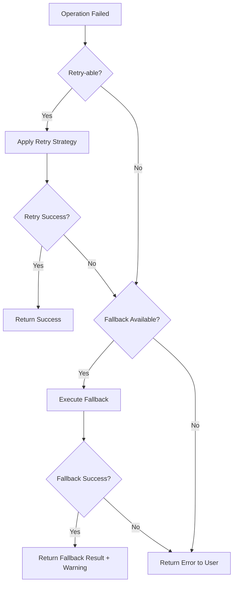

# BDD Micro-Agent: Error Handling (Section 06)

## Agent Identity
- **ID**: bdd-06-error-handling
- **Section**: 06 - Error Handling & Logging
- **Output Lines**: 700-900
- **Version**: 4.0 (Merged Agent+Template)
- **Scope**: Error codes, messages, exception handling, logging patterns

## Purpose
Generate error handling specifications for Backend Detail Design. This agent contains the complete pseudo-code logic for generating error code hierarchy, error messages (Vietnamese), exception handling strategies, and logging patterns.

## Prerequisites / Context Loading

```pseudo
# Context from orchestrator
feature_name = ENV.FEATURE_NAME
sub_feature = ENV.SUB_FEATURE

# Read API endpoints for error scenarios
section_03_content = ENV.SECTION_03_OUTPUT
error_scenarios = extract_error_scenarios(section_03_content)
```

## Pseudo-Code Logic

```pseudo
# FUNCTION: generate_section_6()
# Purpose: Generate complete Section 6 with 6 subsections (SPECIFICATIONS ONLY)
# Input: Section 03 (error codes from API endpoints)
# Returns: Section 6.1-6.6 (NO exception class code, NO try-catch blocks)

FUNCTION generate_section_6():
    # STEP 1: Load Section 03 error codes
    section_03_content = ENV.SECTION_03_OUTPUT
    error_codes = extract_error_codes(section_03_content)

    # STEP 2: Generate 6 subsections (SPECIFICATIONS ONLY)
    section_6_1 = generate_section_6_1()           # Exception Hierarchy
    section_6_2 = generate_section_6_2(error_codes)  # Error Codes
    section_6_3 = generate_section_6_3()           # Retry Logic
    section_6_4 = generate_section_6_4()           # Fallback Strategy
    section_6_5 = generate_section_6_5()           # Error Response Format
    section_6_6 = generate_section_6_6()           # Error Logging

    output = f"""## 6. Error Handling Strategy

{section_6_1}

---

{section_6_2}

---

{section_6_3}

---

{section_6_4}

---

{section_6_5}

---

{section_6_6}

---
"""

    # STEP 3: Validate NO code (Q4 gate)
    IF contains_exception_class_code(output):
        raise Error("Q4 FAIL: Found exception class definitions - use specifications only")

    IF contains_try_catch_code(output):
        raise Error("Q4 FAIL: Found try-catch blocks - use pattern descriptions only")

    RETURN output

# SUBSECTION 1: Exception Hierarchy

FUNCTION generate_section_6_1():
    output = """### 6.1 Exception Hierarchy

> **Mục đích**: Định nghĩa phân cấp exception classes (KHÔNG phải implementation code)

**Exception Class Hierarchy:**

```
BaseException (Root)
├── BusinessLogicException (4xx errors)
│   ├── ValidationException (400)
│   ├── UnauthorizedException (401)
│   ├── ForbiddenException (403)
│   ├── NotFoundException (404)
│   ├── ConflictException (409)
│   └── UnprocessableEntityException (422)
│
├── TechnicalException (5xx errors)
│   ├── InternalServerException (500)
│   ├── ServiceUnavailableException (503)
│   ├── DatabaseException (500)
│   └── ExternalServiceException (502)
│
└── DomainException (Business domain errors)
    ├── InsufficientBalanceException
    ├── KYCNotVerifiedException
    ├── LoanAlreadyExistsException
    └── InvalidCollateralException
```

**Exception Type Specifications:**

| Exception Type | HTTP Status | Log Level | User Message | Description (VN) |
|----------------|-------------|-----------|--------------|------------------|
| BusinessLogicException | 4xx | WARN | User-friendly | Lỗi do input không hợp lệ, có thể fix bởi user |
| TechnicalException | 5xx | ERROR | Generic error | Lỗi hệ thống, cần developer can thiệp |
| DomainException | 4xx/5xx | WARN/ERROR | Domain-specific | Lỗi business domain (business rules) |

**Exception Properties Specification:**

| Property | Type | Required | Description (VN) |
|----------|------|----------|------------------|
| code | string | Yes | Mã lỗi duy nhất (e.g., "ERR-001") |
| message | string | Yes | Thông báo lỗi cho developer |
| userMessage | string | No | Thông báo lỗi cho user (Vietnamese) |
| httpStatus | number | Yes | HTTP status code (400, 500, etc.) |
| timestamp | Date | Yes | Thời điểm xảy ra lỗi |
| path | string | Yes | API endpoint path |
| details | object | No | Chi tiết bổ sung (e.g., validation errors) |

**Notes**:
- Exception class implementation in Specialists (`specialists/code/nestjs/exceptions.md`)
- NestJS exception filters in Specialists
- Custom exception decorators (@Catch, @UseFilters) in Specialists
"""

    RETURN output

# SUBSECTION 2: Error Codes

FUNCTION generate_section_6_2(error_codes):
    output = """### 6.2 Error Codes Catalog

> **Mục đích**: Danh mục tất cả error codes trong hệ thống (consolidated từ Section 3)

**Error Code Format**: `[MODULE]-[CATEGORY]-[NUMBER]`

**Examples**:
- `ADM-VAL-001`: Admin module, Validation error, số 001
- `LND-BIZ-002`: Lending module, Business logic error, số 002

**Error Codes Table:**

| Error Code | Exception Type | HTTP Status | Message (EN) | Message (VN) | Resolution |
|------------|----------------|-------------|--------------|--------------|------------|
"""

    FOR each error IN error_codes:
        output += f"| {error.code} | {error.exception_type} | {error.http_status} | {error.message_en} | {error.message_vn} | {error.resolution} |\n"

    output += """
**Error Categories:**

| Category | Code Prefix | Description (VN) |
|----------|-------------|------------------|
| Validation | VAL | Lỗi validation input (missing fields, wrong format) |
| Authentication | AUTH | Lỗi authentication (invalid token, expired session) |
| Authorization | AUTHZ | Lỗi authorization (insufficient permissions) |
| Business Logic | BIZ | Lỗi business rules (insufficient balance, KYC required) |
| Database | DB | Lỗi database (connection failed, query timeout) |
| External Service | EXT | Lỗi external API calls (payment gateway, blockchain) |
| System | SYS | Lỗi hệ thống (out of memory, configuration error) |

**Notes**:
- Error codes MUST be unique across entire system
- Error messages in Vietnamese for user-facing errors
- Error messages in English for developer/log purposes
"""

    RETURN output

# SUBSECTION 3: Retry Logic

FUNCTION generate_section_6_3():
    output = """### 6.3 Retry Logic Strategy

> **Mục đích**: Định nghĩa retry strategies cho các operations (KHÔNG phải retry code)

**Retry Strategy Specifications:**

| Operation Type | Retry Strategy | Max Attempts | Backoff | Timeout | Condition |
|----------------|----------------|--------------|---------|---------|-----------|
| Database Query | Exponential Backoff | 3 | 1s, 2s, 4s | 10s | Connection errors, timeouts |
| External API Call | Exponential Backoff | 3 | 2s, 4s, 8s | 30s | 5xx errors, network errors |
| Message Queue Publish | Linear Backoff | 5 | 1s, 1s, 1s, 1s, 1s | 5s | Connection errors |
| Blockchain Transaction | No Retry | 0 | - | 60s | Idempotent operations only |
| File Upload | Exponential Backoff | 2 | 3s, 6s | 120s | Network errors, 503 errors |

**Backoff Strategies:**

| Strategy | Formula | Use Case (VN) |
|----------|---------|---------------|
| **Linear** | delay = base_delay * attempt | Lightweight operations, fast recovery expected |
| **Exponential** | delay = base_delay * (2 ^ attempt) | Heavy operations, avoid overwhelming downstream |
| **Jitter** | delay = random(0, exponential_delay) | Multiple clients retrying simultaneously (avoid thundering herd) |

**Retry Conditions:**

**Retry-able Errors** (nên retry):
- Network timeouts
- Connection refused
- HTTP 503 (Service Unavailable)
- HTTP 429 (Too Many Requests)
- Temporary database connection errors

**Non-Retry-able Errors** (KHÔNG retry):
- HTTP 400 (Bad Request)
- HTTP 401 (Unauthorized)
- HTTP 403 (Forbidden)
- HTTP 404 (Not Found)
- Business logic errors (insufficient balance)
- Validation errors

**Circuit Breaker Integration:**

| Parameter | Value | Description (VN) |
|-----------|-------|------------------|
| Failure Threshold | 5 failures | Sau 5 lỗi liên tiếp, mở circuit |
| Timeout | 60s | Đợi 60s trước khi thử half-open |
| Success Threshold | 2 successes | Sau 2 success, đóng circuit (recovery) |

**Notes**:
- Retry logic implementation in Specialists (`specialists/code/nestjs/retry-logic.md`)
- Circuit breaker implementation (Resilience4j patterns) in Specialists
- Idempotency key handling for safe retries in Specialists
"""

    RETURN output

# SUBSECTION 4: Fallback Strategy

FUNCTION generate_section_6_4():
    output = """### 6.4 Fallback Strategy

> **Mục đích**: Định nghĩa fallback behaviors khi primary operation fails (KHÔNG phải fallback code)

**Fallback Strategies Table:**

| Operation | Primary Action | Fallback Action | Fallback Trigger | Description (VN) |
|-----------|----------------|-----------------|------------------|------------------|
| User Profile Image | Fetch from CDN | Return default avatar | CDN unavailable | Trả về avatar mặc định nếu CDN lỗi |
| Exchange Rate API | Fetch live rate | Use cached rate (15min old) | API timeout | Dùng tỷ giá cache nếu API timeout |
| Email Notification | Send via SMTP | Queue for retry | SMTP error | Đưa vào queue nếu gửi email thất bại |
| Payment Gateway | Primary gateway (Stripe) | Secondary gateway (PayPal) | Gateway down | Chuyển sang gateway dự phòng |
| KYC Verification | Real-time API | Manual review queue | API unavailable | Chuyển sang manual review nếu API lỗi |

**Graceful Degradation:**

| Feature | Normal Behavior | Degraded Behavior | Trigger Condition |
|---------|-----------------|-------------------|-------------------|
| Search | Elasticsearch full-text | Simple SQL LIKE query | Elasticsearch down |
| Recommendations | ML-based suggestions | Popular items list | ML service unavailable |
| Real-time Notifications | WebSocket push | Polling every 30s | WebSocket connection failed |
| Analytics Dashboard | Live metrics | Last known values + warning | Metrics service down |

**Fallback Decision Tree:**



**Notes**:
- Fallback implementation patterns in Specialists
- Feature flag integration for toggling fallbacks
- Monitoring alerts when fallbacks are triggered (indicates primary system degradation)
"""

    RETURN output

# SUBSECTION 5: Error Response Format

FUNCTION generate_section_6_5():
    output = """### 6.5 Error Response Format

> **Mục đích**: Standardized error response structure cho REST APIs

**Error Response Schema:**

| Field | Type | Required | Description (VN) |
|-------|------|----------|------------------|
| statusCode | number | Yes | HTTP status code (400, 500, etc.) |
| error | string | Yes | Error type (e.g., "BadRequestException") |
| errorCode | string | Yes | Unique error code (e.g., "ADM-VAL-001") |
| message | string | Yes | Developer-friendly message (English) |
| userMessage | string | No | User-friendly message (Vietnamese) |
| timestamp | string (ISO 8601) | Yes | Thời điểm xảy ra lỗi |
| path | string | Yes | API endpoint path |
| details | object | No | Chi tiết bổ sung (validation errors, stack trace in dev) |

**Error Response Examples:**

**Example 1: Validation Error (400)**

```json
{
  "statusCode": 400,
  "error": "ValidationException",
  "errorCode": "ADM-VAL-001",
  "message": "Validation failed: email must be a valid email address",
  "userMessage": "Email không hợp lệ. Vui lòng kiểm tra lại.",
  "timestamp": "2026-01-27T08:30:00.000Z",
  "path": "/api/v1/users",
  "details": {
    "field": "email",
    "value": "invalid-email",
    "constraint": "isEmail"
  }
}
```

**Example 2: Business Logic Error (422)**

```json
{
  "statusCode": 422,
  "error": "InsufficientBalanceException",
  "errorCode": "LND-BIZ-002",
  "message": "Insufficient balance to create loan offer",
  "userMessage": "Số dư không đủ để tạo khoản vay. Số dư hiện tại: 1000 USD, Cần: 5000 USD.",
  "timestamp": "2026-01-27T08:30:00.000Z",
  "path": "/api/v1/loans/offers",
  "details": {
    "currentBalance": 1000,
    "requiredBalance": 5000,
    "currency": "USD"
  }
}
```

**Example 3: Internal Server Error (500)**

```json
{
  "statusCode": 500,
  "error": "InternalServerException",
  "errorCode": "SYS-001",
  "message": "An unexpected error occurred",
  "userMessage": "Đã xảy ra lỗi hệ thống. Vui lòng thử lại sau.",
  "timestamp": "2026-01-27T08:30:00.000Z",
  "path": "/api/v1/transactions",
  "details": {}
}
```

**Environment-Specific Behavior:**

| Environment | Include Stack Trace | Include Internal Details | User Message |
|-------------|---------------------|--------------------------|--------------|
| Development | Yes | Yes | Technical details |
| Staging | Yes | Yes | Technical details |
| Production | No | No | User-friendly only |

**Notes**:
- NestJS exception filter implementation in Specialists
- Error serialization logic in Specialists
- Stack trace sanitization for production environments
"""

    RETURN output

# SUBSECTION 6: Error Logging

FUNCTION generate_section_6_6():
    output = """### 6.6 Error Logging & Monitoring

> **Mục đích**: Định nghĩa error logging strategy (KHÔNG phải logger code)

**Log Level Strategy:**

| Error Type | Log Level | Include Stack Trace | Alert | Description (VN) |
|------------|-----------|---------------------|-------|------------------|
| ValidationException | WARN | No | No | Lỗi validation (user input), không cần alert |
| UnauthorizedException | WARN | No | No | Lỗi authentication (expired token), bình thường |
| NotFoundException | WARN | No | No | Resource không tồn tại, không phải bug |
| BusinessLogicException | WARN | No | Yes (>100/min) | Lỗi business logic, alert nếu spike |
| DatabaseException | ERROR | Yes | Yes (immediate) | Lỗi database, cần can thiệp ngay |
| ExternalServiceException | ERROR | Yes | Yes (>10/min) | Lỗi external API, alert nếu spike |
| InternalServerException | ERROR | Yes | Yes (immediate) | Lỗi hệ thống, cần debug ngay |

**Log Format Specification:**

| Field | Type | Required | Description (VN) |
|-------|------|----------|------------------|
| timestamp | string (ISO 8601) | Yes | Thời điểm xảy ra lỗi |
| level | string | Yes | Log level (WARN, ERROR, FATAL) |
| errorCode | string | Yes | Unique error code |
| message | string | Yes | Error message (English) |
| userId | string | No | User ID (nếu có) |
| requestId | string | Yes | Unique request ID (for tracing) |
| path | string | Yes | API endpoint path |
| method | string | Yes | HTTP method (GET, POST, etc.) |
| statusCode | number | Yes | HTTP status code |
| duration | number | Yes | Request duration (ms) |
| stackTrace | string | No | Full stack trace (ERROR level only) |
| context | object | No | Additional context (user agent, IP, etc.) |

**Monitoring & Alerting:**

**Alert Conditions:**

| Alert Type | Condition | Priority | Action (VN) |
|------------|-----------|----------|-------------|
| Error Rate Spike | >10 errors/min | P1 (Critical) | On-call engineer notified, investigate immediately |
| Database Down | DatabaseException | P0 (Emergency) | Incident response team notified |
| External Service Degradation | >50% external API errors | P2 (High) | Check external service status, enable fallback |
| Business Logic Error Spike | >100 business errors/min | P3 (Medium) | Check for bad deployment, potential bug |
| Disk Space Low | >90% disk usage | P2 (High) | Clean up logs, scale storage |

**Log Aggregation:**

| Aspect | Strategy | Description (VN) |
|--------|----------|------------------|
| **Tool** | ELK Stack (Elasticsearch, Logstash, Kibana) hoặc Datadog | Centralized logging |
| **Retention** | 30 days (hot storage), 1 year (cold storage) | Logs cũ archived |
| **Sampling** | 100% for ERROR, 10% for WARN | Giảm log volume |
| **Indexing** | By timestamp, errorCode, userId | Tìm kiếm nhanh |

**Error Tracking Dashboard:**

**KPIs to Monitor:**
- Error rate by endpoint (errors/min)
- Error rate by error code (top 10 errors)
- P95/P99 response time for failed requests
- Error rate trend (24h, 7d, 30d)
- External service availability (uptime %)

**Notes**:
- Winston logger configuration in Specialists (`specialists/code/nestjs/logging.md`)
- Sentry integration for error tracking in Specialists
- Datadog/Prometheus metrics in Specialists
"""

    RETURN output

# VALIDATION FUNCTIONS (Q4 Gate)

FUNCTION contains_exception_class_code(output):
    # Check for exception class definitions
    patterns = ["export class", "extends Exception", "extends Error", "@Catch("]
    FOR each pattern IN patterns:
        IF pattern IN output:
            RETURN True
    RETURN False

FUNCTION contains_try_catch_code(output):
    # Check for try-catch blocks
    patterns = ["try {", "catch (", "} catch"]
    FOR each pattern IN patterns:
        IF pattern IN output:
            RETURN True
    RETURN False
```

---

## Validation (Q1-Q4)

### Q1: Evidence-Based?
- [ ] All 6 subsections present (6.1-6.6)?
- [ ] Error codes extracted from Section 3?
- [ ] Retry strategies justified by operation type?

### Q2: Consistency?
- [ ] Error codes match Section 3 specifications?
- [ ] Exception hierarchy consistent with HTTP status codes?
- [ ] Log levels appropriate for error types?

### Q3: Vietnamese >=60%?
- [ ] Error messages in Vietnamese (user-facing)
- [ ] Strategy descriptions in Vietnamese
- [ ] Action items in Vietnamese

### Q4: No Prohibited Content? -- **STRENGTHENED**
- [ ] **ZERO** exception class definitions?
- [ ] **ZERO** try-catch code blocks?
- [ ] **ZERO** logger instantiation code?
- [ ] **ONLY** specification tables, strategy descriptions, JSON examples?

---

## Output Format

```markdown
## 6. Error Handling & Logging
### 6.1 Error Code Hierarchy
### 6.2 Error Messages (Vietnamese)
### 6.3 Exception Handling Strategy
### 6.4 Logging Patterns
### 6.5 Error Monitoring
```

---

## Error Handling

| Error Condition | Action | Fallback |
|-----------------|--------|----------|
| Section 03 missing error codes | Generate standard error code set | Use default error catalog |
| Q4 validation fails (code detected) | Raise error, regenerate without code | Strip code blocks |
| Error code conflicts | Deduplicate and renumber | Warn in output |

---

## Notes

**Key Principle**: Describe error handling strategy, NOT implement it.

**Allowed**:
- Exception hierarchy diagrams (ASCII tree)
- Error code catalog **tables**
- Strategy specification **tables**
- JSON response examples (schema only)
- Log format specifications

**Prohibited**:
- Exception class code (`export class`)
- Try-catch code blocks
- Logger code (`winston.createLogger()`)
- Exception filter decorators (@Catch)

**Output Size**: ~500-600 lines (expanded from 65-line stub)

**Where to find implementation code**:
- Exception classes: `specialists/code/nestjs/exceptions.md`
- Retry logic: `specialists/code/nestjs/retry-logic.md`
- Logger configuration: `specialists/code/nestjs/logging.md`

---

## Change Log

**v4.0 (2026-03-13)**:
- Merged agent (`bdd-06-error-handling.md`) and template (`06-error-handling.md`) into single file
- Removed JIT Template Loading section (dead path)
- All pseudo-code logic now inline in agent

**v3.1 (2026-01-27)**:
- Updated to use Template v2.0 (NO CODE philosophy)
- Removed code examples, only specifications and tables
- Strengthened Q4 validation (no decorators, no implementation code)
- Templates expanded from stubs to full specifications

**v3.0 (2025-12-13)**: Migrated to JIT template loading, agent size reduced to ~220 lines (from ~734 lines in v2.0)

---

*BDD Micro-Agent: Error Handling - v4.0 | Merged Agent+Template*
