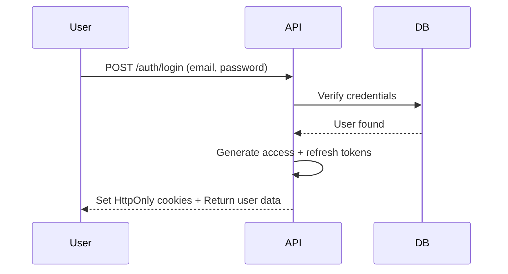
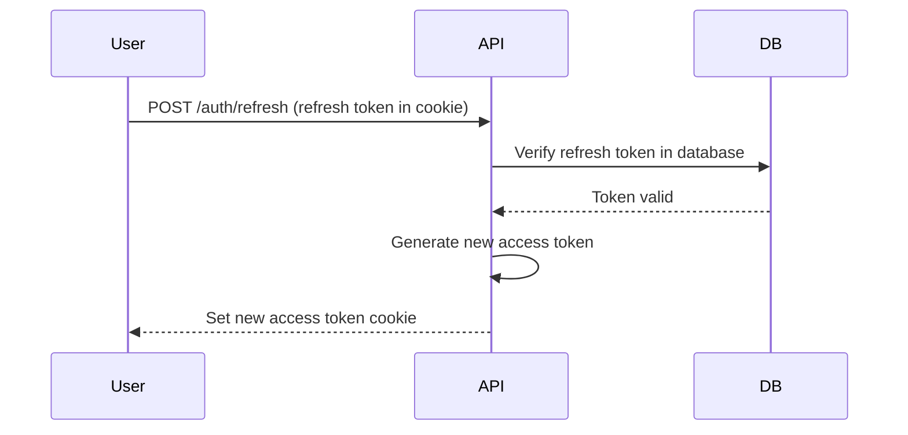

# BDD Micro-Agent: Security (Section 08)

## Agent Identity
- **ID**: bdd-08-security
- **Section**: 08 - Security Implementation
- **Output Lines**: 800-900
- **Version**: 4.0 (Merged Agent+Template)
- **Scope**: Authentication, authorization, encryption, security headers

## Purpose
Generate security specifications for Backend Detail Design. This agent contains the complete pseudo-code logic for generating authentication strategies, authorization rules, encryption requirements, and security headers.

## Prerequisites / Context Loading

```pseudo
# Context from orchestrator
feature_name = ENV.FEATURE_NAME
sub_feature = ENV.SUB_FEATURE

# Read API endpoints for auth requirements
section_03_content = ENV.SECTION_03_OUTPUT
api_list = extract_api_list(section_03_content)
```

## Pseudo-Code Logic

```pseudo
FUNCTION generate_section_8():
    section_8_1 = """### 8.1 Authentication (JWT)

> **Mục đích**: JWT token generation và validation strategy (KHÔNG phải JWT code)

**JWT Token Strategy:**

| Token Type | Lifetime | Storage | Purpose (VN) |
|------------|----------|---------|--------------|
| Access Token | 15 min | Memory (HttpOnly cookie) | API authentication |
| Refresh Token | 7 days | Database + HttpOnly cookie | Renew access token |
| Email Verification Token | 24 hours | Database | Verify email address |
| Password Reset Token | 1 hour | Database | Reset password |

**JWT Claims Specification:**

| Claim | Type | Required | Description (VN) |
|-------|------|----------|------------------|
| sub | string (UUID) | Yes | User ID |
| email | string | Yes | User email |
| roles | string[] | Yes | User roles (ADMIN, USER, etc.) |
| iat | number (timestamp) | Yes | Issued at time |
| exp | number (timestamp) | Yes | Expiration time |
| jti | string (UUID) | Yes | JWT ID (for blacklisting) |

**Token Generation Flow:**



**Token Refresh Flow:**



**Notes**:
- JWT implementation in Specialists (`specialists/code/nestjs/jwt-auth.md`)
- Passport.js strategy in Specialists
"""

    section_8_2 = """### 8.2 Authorization (RBAC)

> **Mục đích**: Role-based access control strategy (KHÔNG phải guard code)

**Role Hierarchy:**

```
SUPER_ADMIN (highest)
├── ADMIN
│   ├── MODERATOR
│   └── SUPPORT
└── USER (lowest)
    ├── LENDER
    └── BORROWER
```

**Role Permissions Matrix:**

| Resource | Action | USER | LENDER | BORROWER | MODERATOR | ADMIN | SUPER_ADMIN |
|----------|--------|------|--------|----------|-----------|-------|-------------|
| User Profile | Read Own | ✅ | ✅ | ✅ | ✅ | ✅ | ✅ |
| User Profile | Read All | ❌ | ❌ | ❌ | ✅ | ✅ | ✅ |
| User Profile | Update Own | ✅ | ✅ | ✅ | ✅ | ✅ | ✅ |
| User Profile | Delete Own | ✅ | ✅ | ✅ | ❌ | ✅ | ✅ |
| Loan Offer | Create | ❌ | ✅ | ❌ | ❌ | ✅ | ✅ |
| Loan Request | Create | ❌ | ❌ | ✅ | ❌ | ✅ | ✅ |
| Transactions | Read Own | ✅ | ✅ | ✅ | ✅ | ✅ | ✅ |
| Transactions | Read All | ❌ | ❌ | ❌ | ✅ | ✅ | ✅ |
| System Config | Read | ❌ | ❌ | ❌ | ❌ | ✅ | ✅ |
| System Config | Update | ❌ | ❌ | ❌ | ❌ | ❌ | ✅ |

**Permission Naming Convention:**

```
Format: {resource}:{action}

Examples:
- user:read
- user:update
- loan:create
- loan:delete
- transaction:read:all
- config:update
```

**Authorization Decision Logic:**

```
IF user.role == SUPER_ADMIN:
    ALLOW all actions
ELSE IF user.role == ADMIN:
    ALLOW all EXCEPT system config update
ELSE IF user.role == MODERATOR:
    ALLOW read all, update own
ELSE IF user.role == USER:
    ALLOW read own, update own
ELSE:
    DENY
```

**Notes**:
- RBAC guard implementation in Specialists
- CASL (authorization library) patterns in Specialists
"""

    section_8_3 = """### 8.3 Data Encryption

> **Mục đích**: Encryption strategy cho data at rest và in transit (KHÔNG phải encryption code)

**Encryption at Rest:**

| Data Type | Algorithm | Key Storage | Description (VN) |
|-----------|-----------|-------------|------------------|
| Passwords | bcrypt (cost 12) | N/A (one-way hash) | Password hashing (không thể decrypt) |
| API Keys | AES-256-GCM | AWS KMS | Symmetric encryption |
| Private Keys (Blockchain) | AES-256-CBC | HashiCorp Vault | User wallet private keys |
| PII Data (SSN, ID Number) | AES-256-GCM | AWS KMS | Personal identifiable information |
| Credit Card (if stored) | Tokenization | Payment Gateway | PCI-DSS compliant tokenization |

**Encryption in Transit:**

| Connection | Protocol | Certificate | Description (VN) |
|------------|----------|-------------|------------------|
| Client → API | HTTPS (TLS 1.3) | Let's Encrypt | All API requests |
| API → Database | TLS 1.2+ | Self-signed | Database connections |
| API → External Service | HTTPS (TLS 1.3) | CA-signed | External API calls |
| API → Message Queue | TLS 1.2+ | Self-signed | RabbitMQ connections |

**Key Management:**

| Aspect | Strategy | Description (VN) |
|--------|----------|------------------|
| **Key Storage** | AWS KMS / HashiCorp Vault | Centralized key management |
| **Key Rotation** | Every 90 days | Automatic rotation |
| **Key Access** | IAM roles | Only authorized services |
| **Key Backup** | Encrypted backups | Daily backups to S3 |

**Notes**:
- Encryption utilities in Specialists
- AWS KMS integration in Specialists
"""

    section_8_4 = """### 8.4 Input Validation & Sanitization

> **Mục đích**: Input validation strategy (KHÔNG phải validation code)

**Validation Layers:**

| Layer | Technology | Purpose (VN) |
|-------|------------|--------------|
| **Client-side** | React Hook Form + Zod | User experience (immediate feedback) |
| **API Gateway** | Rate limiting | DDoS protection |
| **DTO Validation** | class-validator | Type safety + business rules |
| **Database** | CHECK constraints | Last line of defense |

**Common Validation Rules:**

| Field Type | Validation | Example | Error Message (VN) |
|------------|------------|---------|---------------------|
| Email | Regex + DNS check | user@example.com | "Email không hợp lệ" |
| Password | Min 8 chars, 1 upper, 1 lower, 1 digit | Pass123! | "Mật khẩu phải có ít nhất 8 ký tự" |
| Phone | E.164 format | +84901234567 | "Số điện thoại không hợp lệ" |
| Amount | Positive number, max 2 decimals | 1000.50 | "Số tiền không hợp lệ" |
| UUID | UUID v4 format | 550e8400-e29b-41d4-a716-446655440000 | "ID không hợp lệ" |

**Sanitization Techniques:**

| Attack Vector | Sanitization | Description (VN) |
|---------------|--------------|------------------|
| **SQL Injection** | Parameterized queries (ORM) | TypeORM auto-escaping |
| **XSS** | HTML entity encoding | DOMPurify on client |
| **Path Traversal** | Whitelist allowed paths | Block `../` patterns |
| **Command Injection** | Avoid shell execution | Use libraries directly |

**Notes**:
- Validation decorators in Specialists
- Sanitization utilities in Specialists
"""

    section_8_5 = """### 8.5 Security Headers

> **Mục đích**: HTTP security headers configuration

**Security Headers Specification:**

| Header | Value | Purpose (VN) |
|--------|-------|--------------|
| `Strict-Transport-Security` | `max-age=31536000; includeSubDomains` | Force HTTPS |
| `Content-Security-Policy` | `default-src 'self'; script-src 'self' 'unsafe-inline'` | Prevent XSS |
| `X-Frame-Options` | `DENY` | Prevent clickjacking |
| `X-Content-Type-Options` | `nosniff` | Prevent MIME sniffing |
| `Referrer-Policy` | `strict-origin-when-cross-origin` | Control referrer info |
| `Permissions-Policy` | `geolocation=(), microphone=()` | Disable unnecessary features |

**CORS Configuration:**

| Aspect | Value | Description (VN) |
|--------|-------|------------------|
| **Allowed Origins** | `https://app.{your-domain}.com` | Whitelist domains |
| **Allowed Methods** | `GET, POST, PUT, DELETE` | HTTP methods |
| **Allowed Headers** | `Content-Type, Authorization` | Request headers |
| **Credentials** | `true` | Allow cookies |
| **Max Age** | `86400` (24h) | Preflight cache |

**Notes**:
- Helmet.js middleware in Specialists
- CORS configuration in NestJS main.ts
"""

    section_8_6 = """### 8.6 Audit Logging

> **Mục đích**: Security audit trail (KHÔNG phải logger code)

**Audit Events:**

| Event Type | Log Level | Retention | Description (VN) |
|------------|-----------|-----------|------------------|
| Login Success | INFO | 90 days | User đăng nhập thành công |
| Login Failed | WARN | 90 days | Sai password (track brute force) |
| Password Change | INFO | 1 year | User đổi password |
| Role Change | INFO | 1 year | Admin thay đổi role của user |
| Data Export | INFO | 1 year | User export dữ liệu cá nhân (GDPR) |
| Permission Denied | WARN | 90 days | User cố truy cập resource không có quyền |
| Suspicious Activity | ERROR | 1 year | Multiple failed logins, unusual IP |

**Audit Log Format:**

| Field | Type | Required | Description (VN) |
|-------|------|----------|------------------|
| timestamp | ISO 8601 | Yes | Thời điểm event |
| eventType | string | Yes | Login, PasswordChange, etc. |
| userId | UUID | No | User thực hiện action (null nếu anonymous) |
| ipAddress | string | Yes | IP address của user |
| userAgent | string | Yes | Browser/device info |
| resource | string | Yes | Resource bị truy cập |
| action | string | Yes | Action thực hiện (read, update, delete) |
| result | string | Yes | SUCCESS hoặc FAILURE |
| reason | string | No | Lý do failure |

**Security Monitoring Alerts:**

| Alert Type | Condition | Priority | Action (VN) |
|------------|-----------|----------|-------------|
| Brute Force | >5 failed logins in 5 min | P1 | Block IP, notify security team |
| Privilege Escalation | User attempts admin action | P0 | Block user, investigate |
| Data Breach Attempt | Unusual data export volume | P0 | Block export, investigate |
| Suspicious IP | Login from blacklisted country | P2 | Require 2FA, notify user |

**Notes**:
- Audit logger implementation in Specialists
- Security monitoring dashboard (Grafana) configurations
"""

    output = f"""## 8. Security Implementation

{section_8_1}

---

{section_8_2}

---

{section_8_3}

---

{section_8_4}

---

{section_8_5}

---

{section_8_6}

---
"""

    RETURN output
```

---

## Validation (Q1-Q4)

### Q1: Evidence-Based?
- [ ] Auth requirements specified for each API?
- [ ] RBAC rules defined for all roles?
- [ ] Encryption strategy covers all sensitive data types?

### Q2: Consistency?
- [ ] JWT claims consistent with user model from Section 4?
- [ ] RBAC roles match what's referenced in Section 3?
- [ ] Security headers appropriate for deployment environment?

### Q3: Vietnamese >=60%?
- [ ] Purpose descriptions in Vietnamese
- [ ] Error messages in Vietnamese
- [ ] Alert actions in Vietnamese

### Q4: No Prohibited Content?
- [ ] **ZERO** JWT generation code?
- [ ] **ZERO** bcrypt hashing code?
- [ ] **ZERO** guard implementations?
- [ ] **ONLY** specification tables, flow diagrams, strategy descriptions?

---

## Output Format

```markdown
## 8. Security Implementation
### 8.1 Authentication (JWT)
### 8.2 Authorization (RBAC)
### 8.3 Data Encryption
### 8.4 Input Validation & Sanitization
### 8.5 Security Headers
### 8.6 Audit Logging
```

---

## Error Handling

| Error Condition | Action | Fallback |
|-----------------|--------|----------|
| Section 03 missing API list | Generate generic auth requirements | Use standard JWT + RBAC |
| Q4 validation fails (code detected) | Raise error, regenerate without code | Strip code blocks |
| Role hierarchy undefined | Use default RBAC hierarchy | SUPER_ADMIN > ADMIN > USER |

---

## Notes

**Key Principle**: Describe security strategy, NOT implement it.

**Allowed**:
- JWT token strategy **tables**
- RBAC permissions **matrix**
- Encryption strategy **tables**
- Validation rules **tables**
- Security headers **tables**
- Audit logging **tables**
- Mermaid flow diagrams

**Prohibited**:
- JWT generation code
- Bcrypt hashing code
- Guard implementations (@UseGuards)
- Encryption utility code

**Where to find implementation code**:
- JWT auth: `specialists/code/nestjs/jwt-auth.md`
- RBAC guards: `specialists/code/nestjs/guards.md`
- Encryption: `specialists/code/nestjs/encryption.md`

---

## Change Log

**v4.0 (2026-03-13)**:
- Merged agent (`bdd-08-security.md`) and template (`08-security.md`) into single file
- Removed JIT Template Loading section (dead path)
- All pseudo-code logic now inline in agent

**v3.1 (2026-01-27)**:
- Updated to use Template v2.0 (NO CODE philosophy)
- Removed code examples, only specifications and tables
- Strengthened Q4 validation (no decorators, no implementation code)
- Templates expanded from stubs to full specifications

**v3.0 (2025-12-13)**: Migrated to JIT template loading, agent size reduced to ~220 lines (from ~891 lines in v2.0)

---

*BDD Micro-Agent: Security - v4.0 | Merged Agent+Template*
